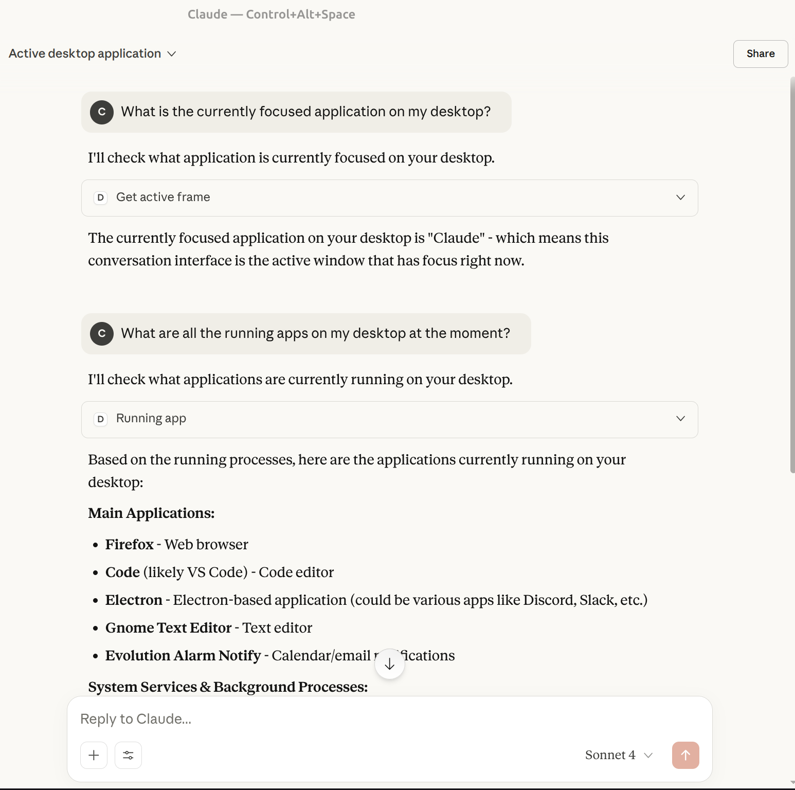

# Accessibility APIs for AI Agents 

AI agents are new and at some level a bit of a marketing term. Yet regardless of how they progress, it is well established that efficient ways of passing context are vital to both their success and all LLM workflows generally. AI agents need ways to retrieve context that are:

1. Efficient at scale 
2. Able to access global state about the entire system

While developers have employed a variety of strategies for this task, I have seen surpringly little integration of accessibility APIs. Screen readers are an excellent example demonstrate their power. They provide a way for a user to gain context and act upon the entire system state in real time without needing any visual stimuli. Developers looking to create efficient AI agents can learn much from their design and UX decisions. 

As a proof of concept, I created a [MCP server for ATSPI](https://github.com/C-Loftus/ATSPI-MCP-Server/), the Linux accessibility API. This allows users to ask the model information about the state of the system in fine grained way. It is easy to create separate tool calls for retrieving a variety of info on system state. Info like the current focused app, the text in the next form input, or even the names of hidden windows that don't appear on screen are all easy to write for developers and are extremely efficient compared to a vision model. 

Before speaking further on this, it is useful to recap how this differs compared to other ways to other ways of obtaining context:

## 1. Taking Screenshots and Using a Vision Model

Many agent tools iterate on a task by taking a screenshot of their progress. For instance, getting text in a form or the currently active window. While this is a reasonable way to prototype, it is very compute intensive and harder to scale. Given the fact the screenshots tend to include lots of extraneous information, it is also a security challenge. 

## 2. Using Browser APIs 

Browser automation tools like Playwright and custom browser extensions are able to more efficiently extract context from websites. They also work cross platform. However, these are limited to the browser. Playwright will not be of much help for gaining info on native applications or system settings. This is fine for some business workflows that stay entirely in the browser, but is a significant limitation to those looking to use agents for personal computing tasks. I believe that agentic tools have much more potential to help people when we do not constrain them to the browser.

## How Accessibility APIs Help

It seems there is significant potential to leverage accessibility APIs. These APIs can get all sorts of info across the entire desktop, ranging all the way from window sizes and app names to the individual roles of UI components. In fact, I am currently working on flexible [accessibility tree traversal helpers](https://github.com/odilia-app/atspi/pull/315) for Linux.

Thus, these APIs can gain global info like the vision models yet expose efficient query APIs like the browser. These are not just proofs of concept. Many users, including those on Linux, are able to use screen readers and leverage accessibility APIs for all their desktop interactions. Since many users do not need assistive tech, it is easy to overlook just how powerful they are.  

Of course, accessibility APIs have their own tradeoffs, otherwise everyone would use them for everything. Accessibility APIs have historically been used by a smaller user base and there are relatively few experts that know the protocols all the way down. To gain context on the state of the entire desktop, you must work at a lower level of abstraction compared to the browser. That being said, in the past accessibility lacked corporate incentives and companies to sponsor further development. With more adoption comes more tooling and an easier developer experience. And besides, one doesn't need to use accessibility APIs for everything. It is very clear that they are a powerful option to supplement agentic tasks and quickly gain global context in a way other options cannot.

---

I am currently working on this by contributing to the [Rust ATSPI crate](https://github.com/odilia-app/atspi). If you are also interested on this topic generally or think I could help you in some way, feel free to [reach out](/contact)!
 