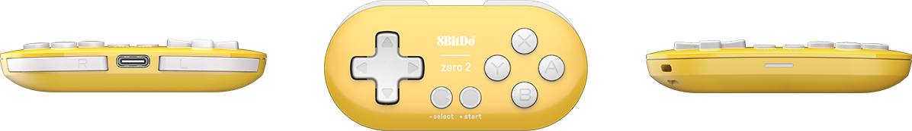

# Semantic Audiobooks with Orca

Lately I have been exploring Orca on Linux as a general audiobook reader and having lots of success.  Historically the issue with audiobooks has always been the fact that they are difficult to navigate through or use as a tool for more intensive study. After all, you can't navigate line by line, extract spoken words as text, or change the speaker on the fly if you are using a standard audiobook. Newer dynamic programs like Microsoft's Immersive reader don't really solve this issue either since they require an internet connection and bind the user to specific applications or text formats. If you can use a screen reader, you can solve many of these issues. Screen readers can jump semantically to any content on the entire desktop and thus are much better for general productivity. However, the challenge has been that screen readers traditionally require a full keyboard to use, or have a high barrier to entry for users without a visual impairment for whom the technology is unfamiliar. Mobile scren readers like VoiceOver on iOS are another option but drastically change how the phone is interacted with and may not be the right tool for someone with general eye strain and not a full vision impairment.

However, when you pair Orca with a small handheld controller like the 8BitDo Zero2 you get the ability to control the screen reader in a way that is both portable and easy to understand. Just bring up the website you want to read and navigate with the controller buttons.  Its a huge potential win for ergonomics as well, since you are no longer bound to sitting at a desk with a keyboard to leverage all the great features of the tech. Theoretically any screen reader works with this setup, but Orca is better suited than some screen readers like VoiceOver since it requires less key presses and has a simpler model of navigation.



This turns listening to audiobooks into a much more productive and enjoyable pasttime. Instead of needing to skip around to a section I am interested in, I can just press a button to do things like skip to the next paragraph or tap another to go back until the previous heading at a specific level such as h2 or h3. This is entirely unfeasible for audiobooks in a static format that aren't generated on the fly. 

In my case, I have specifically bound buttons on the controller to the up and down arrows keys, as well as `Orca+;` key combination which reads everything below the current cursor. Since my config is so simple, it also helps to give the illusion of abstracting away the more complicated behavior from the underlying screen reader. I can easily give the controller to a friend who knows nothing of the underlying tool and have them use it no problem. We shouldn't underestimate the importance of easy a11y tools and the importance of low barriers to entry. 

Another great thing as well is that the controller in question works out of the box on Ubuntu 24.04. You can use a no-code tool like [input-remapper](https://github.com/sezanzeb/input-remapper) to bind each key press to an orca command. There are many possibilities for this, many of which I am just starting to explore. For instance, you could bind a button press to copy the most recently spoken paragraph and upload it to notion, essentially giving you the ability to take notes while listening with a single button press. This may seem like a vanity, but for those with eyestrain or vision impairment, this is a great quality of life improvement. 

A simple config for `input-remapper` could be placed at: `~/.config/input-remapper-2/presets/Pro Controller` and look something like this. (The keycodes may be different for your machine, but the general pattern is similar)

```
[
    {
        "input_combination": [
            {
                "type": 1,
                "code": 305,
                "origin_hash": "3e54359ab646ec4adb9b70981f17eefc"
            }
        ],
        "target_uinput": "keyboard",
        "output_symbol": "KEY_UP",
        "mapping_type": "key_macro"
    },
    {
        "input_combination": [
            {
                "type": 1,
                "code": 308,
                "origin_hash": "3e54359ab646ec4adb9b70981f17eefc"
            }
        ],
        "target_uinput": "keyboard",
        "output_symbol": "KEY_DOWN",
        "mapping_type": "key_macro"
    },
    {
        "input_combination": [
            {
                "type": 1,
                "code": 314,
                "origin_hash": "3e54359ab646ec4adb9b70981f17eefc"
            }
        ],
        "target_uinput": "keyboard",
        "output_symbol": "KEY_CAPSLOCK + KEY_SEMICOLON",
        "mapping_type": "key_macro"
    }
]
```

Then once you run `sudo systemctl enable input-remapper` in the terminal, these bindings will automatically be applied at boot. Given the fact the controller itself can also auto-pair, there is very low friction when using this workflow.

At the moment, the main limiting factor is Linux mobile hardware. There aren't many great mobile devices that support Orca. You could either use a Raspberry Pi with a rechargable battery, stay in the range of the bluetooth from your Linux laptop, or try experimenting with newer Linux mobile devices like the Pinephone. Even until Linux mobile devices get better support, being able to use this workflow while relaxing at home, stretching out, or doing chores is very pleasant. 

In the future there is no reason why we can't integrate such a tool with voice control and get even further productivity gains. For instance, jumping to a specific spoken query or editing a screen reader setting on the fly could easily be done if an onboard mic were present. Being able to do all of this without needing to look at a screen whatsoever or sit at a desk is a huge win towards making our interactions with computers more healthy and diversified. 

That is why, regardless of the current limitations, the general idea of improving audiobook tech is something that is of great interest to me. Eye strain is only geting more prevalent among the population and we need audio solutions that are easy to understand, control, and study with. At the same time, the development communities around screen readers need more help and resources. It is important to keep these spaces  and software focused on helping people with disabilities, but I think we can also expand use cases and user personas in a way that is a net win for all. Screen readers are such a fantastic piece of tech that ought to be used more widely.

If you are also interested in this topic or could use help setting up a custom screen reader workflow, feel free to reach out. 